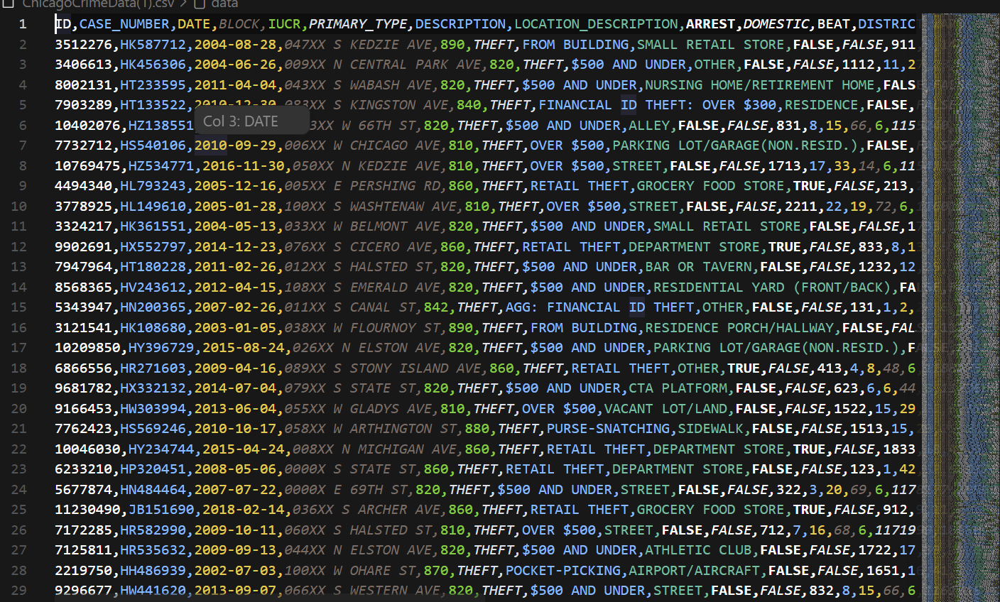
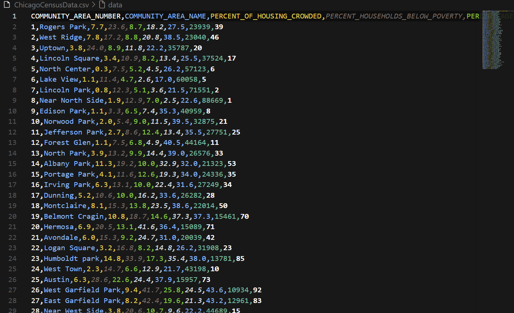
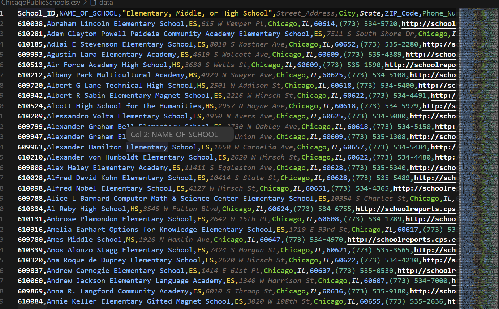
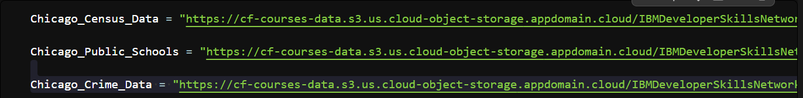
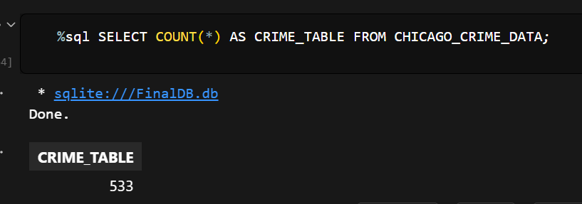
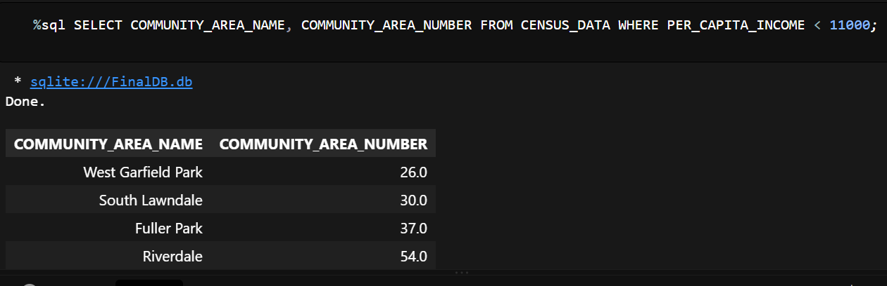

# Chicago Data Analysis Using Python & SQLite

A practical data analysis project focused on exploring **Chicago crime, public school, and socioeconomic data** using Python, Pandas, SQL, and SQLite.

The project follows a complete workflow:

**Raw Data → Data Preparation → SQLite Database → SQL Analysis → Results → Insights**

---

## 📌 Project Overview

This project combines three Chicago public datasets and stores them in a structured SQLite database.

The main goal was to use **Python and SQL together** to investigate real-world analytical questions related to:

- Crime records
- Socioeconomic conditions
- Community income
- Public schools
- School-related crime
- Crime records involving minors and children

The analysis was performed using **Jupyter Notebook**, with Pandas used for data handling and SQLite used as the database layer.

---

## 📊 Datasets Used

| Dataset | Description |
|---|---|
| Chicago Census Data | Socioeconomic and community-level information |
| Chicago Public Schools Data | Public school characteristics and related information |
| Chicago Crime Data | Reported crime incidents and case details |

### Dataset Preview

### Chicago Crime Data



### Chicago Census Data



### Chicago Public Schools Data



# 🔄 Project Workflow

```text
Chicago Public Datasets
          │
          ▼
       CSV Files
          │
          ▼
   Pandas DataFrames
          │
          ▼
   Data Preparation
          │
          ▼
    SQLite Database
          │
     ┌────┼────┐
     ▼    ▼    ▼
  Census  Schools  Crime
    Data    Data   Data
     │      │      │
     └──────┼──────┘
            ▼
       SQL Analysis
            │
            ▼
       Query Results
            │
            ▼
          Insights
```

---

# 🗄️ Database Design

The SQLite database created for this project is:

```text
FinalDB.db
```

It contains three primary tables:

```text
FinalDB.db
│
├── CENSUS_DATA
│
├── CHICAGO_PUBLIC_SCHOOLS
│
└── CHICAGO_CRIME_DATA
```

### Database Structure



<!-- You can replace the image above with your own screenshot -->

---

## 🐍 Python–SQLite Connection

Python's built-in `sqlite3` library was used to create and connect to the SQLite database.

```python
import pandas as pd
import sqlite3
import csv

conn = sqlite3.connect("FinalDB.db")
cur = conn.cursor()
```

Pandas DataFrames were converted into SQL tables using `to_sql()`.

```python
df.to_sql(
    "TABLE_NAME",
    conn,
    if_exists="replace",
    index=False
)
```

---

# 📈 SQL Analysis

## 1. Total Crime Records

The crime dataset contains **533 records** in the analyzed dataset.

### SQL Query

```sql
SELECT COUNT(*)
FROM CHICAGO_CRIME_DATA;
```

### Result

```text
533
```

### Screenshot



---

## 2. Communities With Per-Capita Income Below $11,000

The analysis identified four community areas with a per-capita income below `$11,000`.

| Community | Community Number |
|---|---:|
| West Garfield Park | 26 |
| South Lawndale | 30 |
| Fuller Park | 37 |
| Riverdale | 54 |

### SQL Query

```sql
SELECT COMMUNITY_AREA_NAME,
       COMMUNITY_AREA_NUMBER
FROM CENSUS_DATA
WHERE PER_CAPITA_INCOME < 11000;
```

### Screenshot



---

## 3. Crime Records Involving Minors

Crime descriptions were searched for the term `MINOR`.

### SQL Query

```sql
SELECT CASE_NUMBER
FROM CHICAGO_CRIME_DATA
WHERE DESCRIPTION LIKE '%MINOR%';
```

### Case Numbers Identified

```text
HL266884
HK238408
```

### Screenshot


---

## 4. Kidnapping Involving a Child

The crime data was filtered for kidnapping records where the description contains `CHILD`.

### SQL Query

```sql
SELECT *
FROM CHICAGO_CRIME_DATA
WHERE PRIMARY_TYPE = 'KIDNAPPING'
AND DESCRIPTION LIKE '%CHILD%';
```

### Result

| Case Number | Crime Type | Description |
|---|---|---|
| HN144152 | KIDNAPPING | CHILD ABDUCTION/STRANGER |

### Screenshot


---

## 5. Crime Types Recorded at Schools

SQL pattern matching was used to identify crime records associated with school locations.

### SQL Query

```sql
SELECT DISTINCT PRIMARY_TYPE
FROM CHICAGO_CRIME_DATA
WHERE LOCATION_DESCRIPTION LIKE '%SCHOOL%';
```

### Crime Types Identified

- BATTERY
- CRIMINAL DAMAGE
- NARCOTICS
- ASSAULT
- CRIMINAL TRESPASS
- PUBLIC PEACE VIOLATION

### Screenshot


---

## 6. Exploring the School Table Structure

SQLite metadata was used to inspect the structure of the public schools table.

```sql
PRAGMA table_info(CHICAGO_PUBLIC_SCHOOLS);
```

This provides information about the columns and structure of the table.

### Screenshot


---

# 📊 Key Results

| Analysis | Result |
|---|---:|
| Crime records analyzed | **533** |
| Communities below $11,000 per-capita income | **4** |
| Minor-related case numbers identified | **2** |
| Child-related kidnapping records identified | **1** |
| Distinct crime categories at school locations | **6** |
| SQLite tables created | **3** |

---

# 🧠 Key Insights

## Socioeconomic Analysis

The census dataset provides community-level indicators such as:

- Per-capita income
- Poverty
- Unemployment
- Education levels
- Housing conditions
- Hardship index

These variables can be used to compare socioeconomic conditions across different Chicago communities.

---

## Crime Analysis

SQL filtering and pattern matching were used to isolate specific crime records.

For example:

```sql
WHERE DESCRIPTION LIKE '%MINOR%'
```

This condition searches crime descriptions for references to minors.

---

## School-Related Crime

The following SQL condition was used to identify records associated with school locations:

```sql
WHERE LOCATION_DESCRIPTION LIKE '%SCHOOL%'
```

This helped identify the different crime categories appearing in school-related locations.

---

## Database Management

The three datasets were organized into a SQLite database instead of being analyzed only as separate CSV files.

This made it possible to query the data using SQL and maintain a structured relational data environment.

---

# 💻 SQL Skills Demonstrated

This project includes practical use of:

```text
SELECT
WHERE
LIKE
DISTINCT
COUNT()
AVG()
MAX()
GROUP BY
ORDER BY
LIMIT
Subqueries
PRAGMA
```

### Filtering

```sql
SELECT *
FROM CENSUS_DATA
WHERE PER_CAPITA_INCOME < 11000;
```

### Pattern Matching

```sql
SELECT *
FROM CHICAGO_CRIME_DATA
WHERE DESCRIPTION LIKE '%MINOR%';
```

### Counting Records

```sql
SELECT COUNT(*)
FROM CHICAGO_CRIME_DATA;
```

### Distinct Values

```sql
SELECT DISTINCT PRIMARY_TYPE
FROM CHICAGO_CRIME_DATA;
```

---

# 🐍 Python Skills Demonstrated

Through this project, I worked with:

- Python
- Pandas
- DataFrames
- CSV files
- Data preparation
- SQLite
- SQL queries
- Database connections
- Jupyter Notebook
- DataFrame-to-SQL conversion

### Example Database Connection

```python
import pandas as pd
import sqlite3

conn = sqlite3.connect("FinalDB.db")
cur = conn.cursor()
```

---

# 🛠️ Technology Stack

| Technology | Purpose |
|---|---|
| Python | Data processing and database integration |
| Pandas | Data loading and DataFrame manipulation |
| SQL | Data querying and analysis |
| SQLite | Relational database management |
| Jupyter Notebook | Interactive analysis |
| PrettyTable | Query result formatting |
| IPython-SQL | Running SQL inside Jupyter |

---

# 🖼️ Project Screenshots

You can add your own screenshots in this section.

## Jupyter Notebook


## Database Tables


## SQL Results


## Database Structure


## Crime Analysis


## Socioeconomic Analysis


## School Crime Analysis


---

# 📁 Project Structure

```text
Create-Access-SQLite-database-using-Python/
│
├── final_project.ipynb
├── FinalDB.db
│
├── data/
│   ├── ChicagoCensusData.csv
│   ├── ChicagoPublicSchools.csv
│   └── ChicagoCrimeData.csv
│
├── screenshots/
│   ├── datasets-preview.png
│   ├── database-structure.png
│   ├── database-tables.png
│   ├── jupyter-notebook.png
│   ├── sql-results.png
│   ├── crime-count.png
│   ├── income-analysis.png
│   ├── minor-crime-analysis.png
│   ├── kidnapping-analysis.png
│   ├── school-crime-analysis.png
│   └── school-table-structure.png
│
├── presentation/
│   └── Chicago_Data_Analysis_SQL.pptx
│
└── README.md
```

---

# 🚀 How to Run the Project

## 1. Clone the Repository

```bash
git clone https://github.com/CyberWol-12/Create-Access-SQLite-database-using-Python.git
```

## 2. Navigate to the Project

```bash
cd Create-Access-SQLite-database-using-Python
```

## 3. Install Dependencies

```bash
pip install pandas ipython-sql prettytable
```

## 4. Launch Jupyter Notebook

```bash
jupyter notebook
```

## 5. Open the Notebook

```text
final_project.ipynb
```

Run the notebook cells sequentially to recreate the database and reproduce the analysis.

---

# 🎯 What This Project Demonstrates

This project demonstrates a complete data analysis workflow:

```text
Data Ingestion
      ↓
Data Preparation
      ↓
Database Creation
      ↓
SQL Querying
      ↓
Data Analysis
      ↓
Result Interpretation
```

It demonstrates the ability to:

- Work with multiple real-world datasets
- Load and prepare data using Python
- Build a relational SQLite database
- Write SQL queries for analytical questions
- Combine Python and SQL in one workflow
- Analyze structured datasets
- Interpret query results
- Organize data for repeatable analysis

---

# 🚀 Future Improvements

Possible extensions for this project include:

- Building an interactive Power BI dashboard
- Creating Tableau visualizations
- Performing geographic crime analysis
- Adding advanced SQL joins
- Performing time-series crime analysis
- Exploring school safety trends
- Creating socioeconomic comparison dashboards
- Automating SQL reports
- Applying machine learning techniques to relevant datasets

---

# 👩‍💻 About Me

## Divya Upadhyay

**B.Tech Computer Science | Artificial Intelligence**

I am interested in:

**Data Science • Machine Learning • Artificial Intelligence • Data Analytics • Python • SQL • Database Management**

I enjoy working with real-world datasets and building practical projects that transform raw data into structured analysis and meaningful insights.

---

# 📫 Connect With Me

- **GitHub:** https://github.com/CyberWol-12
- **LinkedIn:** https://www.linkedin.com/in/divya-upadhyay-a77060348
- **Email:** divyau0802@gmail.com

---

# ⭐ Project

If you found this project interesting, feel free to explore the repository, notebook, database, and analysis.

---

**Built with Python, SQL, SQLite, and curiosity.**